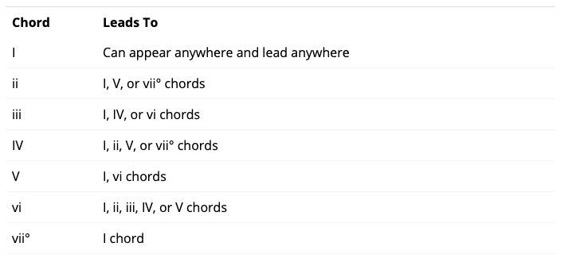
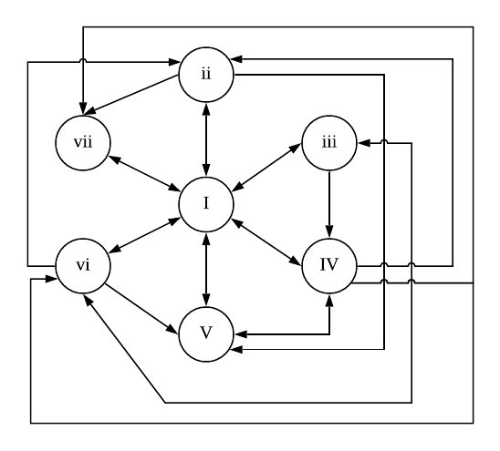

# CPSC 531 Supercollider Notes

**10-07-2019 Notice:** The purpose of this repository is to more easily share and discuss my work in CPSC 431/531 with current students. After this Fall 2019 semester, this repo will become private so as to protect the integrity of the assignments and future students' work. 

---------
**Rebecca Ramnauth** </br>
Computer Science PhD Student </br>
Yale University | AKW 507 | [rramnauth2220.github.io](rramnauth2220.github.io) </br>

---------
## Musical Mealy Machine

Generates mealy machine which generates chord progressions and modulations between keys. 

### General Information
- example output progressions available on YouTube at [https://www.youtube.com/playlist?list=PL6PK-gyv7Apqd1jMrLTKxRtt6LnFbO-DO](https://www.youtube.com/playlist?list=PL6PK-gyv7Apqd1jMrLTKxRtt6LnFbO-DO)
- source code is available on GitHub as [https://github.com/rramnauth2220/cpsc-531-supercollider/tree/master/RAMNAUTH-531-Project-3](https://github.com/rramnauth2220/cpsc-531-supercollider/tree/master/RAMNAUTH-531-Project-3)

### Rules for System Generation

The system will *generate* a mealy machine according to given rules. In Western tonal music, such rules may include that a dominant chord is generally follows by either a tonic or subdominant chord. According to Dummies.com's [Creating Music with Chord Progressions](https://www.dummies.com/art-center/music/piano/creating-music-with-chord-progressions/), the following are common chord movements in Western tonal music. 



This is programmatically represented as a multidimensional list 

```supercollider
~rules = [ // on generating 'valid' chord progressions
	[2, 3, 4, 5, 6, 7],     // tonic         // I
    [1, 5, 7],              // supertonic    // ii
    [1, 4, 6],              // mediant       // iii
    [1, 2, 5, 7],           // subdominant   // IV
    [1, 4],                 // dominant      // V
    [1, 2, 3, 4, 5],        // submediant    // vi
    [1]                     // leading tone  // vii
];
```

where, essentially, each sub-element is a pointer to another element. Traversing these tonal 'rules' will output a mealy machine by which we generate valid chord progressions in any given key(s). The method for traversing these universe of rules is as follows:

```supercollider
// gives progression of @num length by traversing @map starting at element @start
	~getProgression = {
		| map, num, start = 1 |
		var progression = [start];
		var current_node = start; // define initial state
		for (0, num - 2, {
			arg i;
			var next_node = map[current_node - 1][(map[current_node - 1].size - 1).rand]; // create state
			progression = progression.add(next_node); // add state to machine
			current_node = next_node; // move to next state
		});
		progression;
	}; // test case // ~getProgression.value(~rules, 4, 1);
```

This produces a machine that generates progressions, in which each scale degree states are not equally likely to be arrived at. In other words, certain progressions may highlighted and their corresponding conenctions preferred.



### Moving through the System

Other inputs that influence the definition of a chord and how that chord is played:

```supercollider
    ~orientation = [0, 2, 4]; // tonic triad // intervals between notes
	~progression_length = 4; // length of chord progression
	~start_degree = 1; // start on this scale degree (tonic)
	~scale = Scale.major; // [1, 2, 5, 6, 7, 9, 12]; // or can use Scale.major/minor/shang
	~keys = [0, 1, 5, 2, 5, 7]; // keys to modulate between
```

Chords of a specified key are generated using the following method after generating a state machine using ```~getProgression```.

```supercollider
// return a dictionary object after applying @progression using @orientation starting from @root in @key
	~getChords = {
		| key, orientation, root, progression, returnHome = false |
		var chords;
		var result = Dictionary.new;
		for (0, progression.size - 1, {
			arg i;
			chords = chords.add(key.at(orientation) + root + progression[i] + 60);
		});
		if (returnHome == true) { chords = chords.add(chords[0]); };

		result.add(\chords -> chords);
		result.add(\key -> key);
		result.add(\root -> root);
		result.add(\orientation -> orientation);
		result.add(\progression -> progression);

		result;
	}; // test case // ~getChords.value(Scale.major, ~orientation, ~root - 6, ~testProgression, true);
```

This can be extended in order to get a scale of chords in a specified key. This is extension is provided as the following method:

```supercollider
    // returns a dictionary object which is a progression of chords
	// of orientation @orientation that reflects a scale of @root in @key of length @length
	~getProgressionScale = {
		| key, root, length, orientation |
		var progression = ~getChords.value(key, orientation, root, Array.fill(length, { arg i; key[i]; }), false);
		progression;
	}; // test case // ~getProgressionScale.value(Scale.minor, 0, 7, ~orientation);
```

We can then follow this progression according to the scale output. 

```supercollider
    // return chords of @progression in scale of @scale
	~followProgression = {
		| progression, scale |
		var chords;
		for (0, progression.size - 1, {
			arg i;
			chords = chords.add(scale.at(\chords)[progression[i] - 1]);
		});
		chords;
	}; // test case // ~followProgression.value(~testProgression, ~testScale);
```

### Transitioning between Two Keys

Transitions between states in the machine are defined as *chord modulations*. One type of modulation implemented in this program is a *diatonic-pivot*. A pivot is a common chord between two given keys. However, between two keys there are three possible situations when attempting to use a diatonic pivot modulation:

1. a single pivot can be identified
2. there is no common chord, and therefore no pivot
3. there are several pivots, and for a single pivot to be deterministically selected, preferences or a system of ranking must first be declared

For the scope of this project and due to time constraints, the first scenario has been fully implemented. Prototypes of the other two scenarios are documented in the code as ```~getPreScaleDegree``` for situation where there are multiple valid pivots and *phrase modulation* is implied if no pivot chords can be identified. 

In determining the pivot chords of two keys:

```supercollider
    ~getPivotChords = {
		| from, to |
		var from_scale = ~getProgressionScale.value(from.at(\key), from.at(\root), ~scale.size, from.at(\orientation));
		var to_scale = ~getProgressionScale.value(to.at(\key), to.at(\root), ~scale.size, to.at(\orientation));
		var pivots = from_scale.at(\chords).asSet & to_scale.at(\chords).asSet;
		pivots;
	}; // test case // ~getPivotChords.value(~getProgressionScale.value(Scale.major, 0, 7, [0, 2, 4]), ~getProgressionScale.value(Scale.major, 0, 7, [0, 2, 4])).asArray;
```

After the transition between two keys is defined, we can generate a progression that involves a modulation between two keys:

```supercollider
    // compute modulation with pivot chord at @pivot_index between @from and @to keys
	~getModulation = {
		| map, from, to, progression, degree, pivot_index = -1 |
		// follow the progression according to scale/key
		var from_chords = ~followProgression.value(progression, from);
		var to_chords = ~followProgression.value(progression, to);
		
		// identify potential pivot chords
		//var preference = ~getPreScaleDegree.value(map, degree); // next steps, choosing a pivot chord in the case of multiple pivot
		var pivots = (from.at(\chords).asSet & to.at(\chords).asSet).asArray;
		var pivot = pivots[pivots.size.rand];

		var result;
		if (pivot_index <= 0) { // cannot have pivot index to be 0, else not a modulation
			/* no split in progression among keys */
			for (0, progression.size - 1, { arg i; result = result.add(from_chords.at(i)); });
			result = result.add(pivot);
			for (0, progression.size - 1, { arg i; result = result.add(to_chords.at(i)); });
		} { /* split progression among keys */
			for (0, pivot_index - 1, { arg i; result = result.add(from_chords.at(i)); });
			result = result.add(pivot);
			for (pivot_index, progression.size - 1, { arg i; result = result.add(to_chords.at(i)); });
		};

		result; // return resulting progression with modulation
	};
```

Using this function is as follows:

```supercollider
	// test case
	~resultMod = ~getModulation.value(
		~rules,
		~getProgressionScale.value(Scale.major, 0, 7, ~orientation),
		~getProgressionScale.value(Scale.major, 5, 7, ~orientation),
		~testProgression,
		5,
		0
	); // next steps, common-chord pivots are defined as predominant chords such as in Western tonal music
```

### Transitioning between Multiple State Keys

This process for transitions between two keys can be generalized for modulating between any number of keys. This is defined as a line of progressions and modulations: 

```supercollider
    ~getLine = {
		| map, keys, progression, degree = 5, split = 0 |
		var result;
		var prev_key = keys.at(0); // keep track of previous state
		for (1, keys.size - 1, {
			arg i;
			var r = ~getModulation.value( // perform modulation
				map,
				~getProgressionScale.value(~scale, prev_key, ~scale.size, ~orientation),
				~getProgressionScale.value(~scale, keys[i], ~scale.size, ~orientation),
				progression,
				degree,
				split
			);
			prev_key = keys[i]; // update state
			for (0, r.size - 1, { arg i; result = result.add(r[i]); });
		});
		result;
	}; // test case // ~getLine.value(~rules, [0, 5, 2], ~testProgression);
```

### Mapping System Inputs to Outputs

The process of generating a machine that generates valid chord progressions and modulations is a three-part process. 

1. Generate the state machine using tonal rules:
```~inProgression = ~getProgression.value(~rules, ~progression_length, ~start_degree)```
2. Create and organize resulting chord progressions and modulations into a sequence: ```~outputLine = ~getLine.value(~rules, ~keys, ~inProgression);```
3. Play the result: 
```supercollider
	Pbind(
		\instrument, \piano,
		\freq, Pseq(~outputLine.midicps, 1),
		\dur, 1
	).play;
```

---------
## Midterm: Musique Concrète

Generative musique concrète in SuperCollider. 

### General Information 
- example output compositions are available on both SoundCloud at [soundcloud.com/rramnauth2220/sets/musique-concrete](https://soundcloud.com/rramnauth2220/sets/musique-concrete) and YouTube at [https://www.youtube.com/playlist?list=PL6PK-gyv7Apqc5HYcv96DZ5INr4xcGCdF](https://www.youtube.com/playlist?list=PL6PK-gyv7Apqc5HYcv96DZ5INr4xcGCdF). **FYI**, SoundCloud and YouTube has their own compression and standardizing formats, so the outputs sound different there. For the orginal output files, check out [https://github.com/rramnauth2220/cpsc-531-supercollider/tree/master/RAMNAUTH-531-Midterm/outputs](https://github.com/rramnauth2220/cpsc-531-supercollider/tree/master/RAMNAUTH-531-Midterm/outputs)
- complete source code is available on GitHub at [https://github.com/rramnauth2220/cpsc-531-supercollider/tree/master/RAMNAUTH-531-Midterm](https://github.com/rramnauth2220/cpsc-531-supercollider/tree/master/RAMNAUTH-531-Midterm)
- fragment recordings and log are available on Google Drive at [https://bit.ly/33KrHSD](https://bit.ly/33KrHSD)

### Concrète Recordings

**Musique concrète** is a method of music composition which uses recorded sounds as raw material. As a result, *fragment sounds* (i.e., "a fragment of a sound object... in which a 'center of interest' can be identified" seem obscured and/or unconnected to their source ([Schaeffer](https://github.com/rramnauth2220/cpsc-531-supercollider/blob/master/531-Readings/Schaeffer_Concrete-Theory.pdf) 3). Cottle reminds us that live music "has a dimension recorded pieces do not" which is the "potential for growth and change" ([Cottle](https://github.com/rramnauth2220/cpsc-531-supercollider/blob/master/531-Readings/Cottle_concrete-in-SC3.pdf) 123). He further argues this claim by stating that "many people equate a recording with a performance. In a sense it has tainted our expectations: we attend a concert expecting what we heard on the CD." While this may be a true social phenomenon, I believe that when Cottle implies that concrète achieves what "digital manipulation do that can't be done on any other instrument," we must really reconsider what fits the category of 'instruments' and what digital manipulation has attempted and is attempting to do. With this said, it seems that concrète strategies (e.g., looping, pitch and time shifting, reversals, and abrupt edits) are already commonplace and its more rare to hear about celebrated acoustic compositions (without explicitly googling them) than those which are electronically manipulated. 

Notwithstanding the present regard for musique concrète, I found this midterm to be a unique design challenge: collating fragment recordings according to some <span style="background-color: #fff6bd">rules of categorization, transformation, and synthesis.</span> To begin, I thought of several themes to impose a kind of structure on the program and my expectations of what the output should be like. One theme I was enthused about was using recordings of water to cover [Handel's Water Suite](https://en.wikipedia.org/wiki/Water_Music). Although interesting, this was rather uncreative (or creative along one dimension: pairing fragments sources to an existing composition) and left little room for next steps once achieved. A theme that relates to more than one of three dimensions (i.e., categorization, transformation, and synthesis) of the assignment would not fulfill Cottle's definition of concrète to have "potential for growth and change". In addition, having fragment sounds that become obscured or disconnected from their origin is characteristic of concrète&mdash;so it didn't make sense record water sounds and pattern them to the Water Suite in the hopes someone will catch the pun. 

As such, my [recordings](https://drive.google.com/drive/folders/1mkOFGRBSr9o-VVtMj5kUgKsSV-WBHUPM?usp=sharing) didn't have any coherent story between them. They were typically sounds of items in my apartment building (e.g., heater, dryer and washing machines, doors, elevators). I edited a select few recordings to either amplify or obscure the source. However. it didn't really matter how these recordings were initially altered, because I thought it would be more interesting to automate this in my program. 

### Categorization

(A novice musician,) I assume that most music, especially pop songs, tend to have 4 primary components: (1) a underlying beat for the purpose of rhythm-keeping, (2) a main instrument (often human vocals), (3) a kind of melody/motif, and (4) background music/noise/stuff. As such, I organized my fragment recordings into ambient  (either of background sounds or human speech) and subject recordings. This is reflected in the directory tree, as follows:

```supercollider
.
├── RAMNAUTH-531-Musique-Concrete.scd
├── outputs
│   ├── 0_0_mel_0_twinkle.aiff
│   ├── met_0_mel_amb_graveyard.aiff
│   ├── met_voc_mel_0_beethoven.aiff
│   ├── // additional sample outputs of final program
├── patternize.sc
└── samples // dir holding all recordings
    ├── ambient
    │   ├── sound
    │   │   ├── cemetery_night.wav
    │   │   ├── rain.wav
    │   │   └── // additional background sounds
    │   └── speech
    │       ├── 0.185.wav
    │       ├── 0.187.wav
    │       └── // additional human speech recordings
    ├── midi
    │   ├── beethoven_opus10_1.mid
    │   ├── chopin_nocturne.mid
    │   ├── twinkle_twinkle.mid
    │   └── // additional midi files
    └── subject
        ├── clock_ticking.wav
        ├── heater_hum.wav
        └── // additional subject recordings
```

At first, I thought it would be interesting (and, eventually found, not immediately useful) to automate this organization by having the program determine which sound files are of ambient or subject sounds. According to the midterm specifications, the program must be of one-click evaluation. A function to differentiate between sound types would make this a two-part evaluation if I was okay with having to recompute the organization of ambient versus subject sound at every runtime&mdash;I wasn't. 

On the one hand, the process of choosing which samples to use from each subdirectory is a random process. On the other hand, the processes of how many samples to choose and from which subdirectory are not. The program will initially read a specified number of note pitches, amplitudes, and durations from a given midi file, then generate a Markov chain of a specified order, and output a sequence of a specified length using the generated Markov model. As such, the user-controllable inputs are as follows:

```supercollider
	~metronome_voice = true;    ~metronome_amp = 0.25;    // rhythm
	~vocal_voice = true;        ~vocal_amp = 0.25;        // main "vocals"
	~melody_voice = true;       ~melody_amp = 0.25;       // repeating "melody"
	~ambient_voice = true;      ~ambient_amp = 0.75;      // ambient speech + background

	~measures = inf; // # of measures
	~rate = 0.3; // audio rate

	~input = "samples/midi/chopin_nocturne.mid"; // patterns derived from given midi file
	~patternLength = 50; // how much data to take from midi input
	~chainLength = 500; // resulting chain length
	~chainOrder = 2; // order of Markov Chain
```

### Transformation

I defined four 'voices': the ```~metronome_voice```, ```~vocal_voice```, ```~melody_voice```, and ```~ambient_voice```. Each voice is generated independently of each other. 

#### Vocals

This voice is the result of reading note events of a given midi file. The example midi files provided in the ```/samples/midi/``` directory were downloaded from [kunstderfuge.com](http://kunstderfuge.com/). Only ```~patternLength``` note events from the midi file are extracted for the purpose of runtime efficiency.

```supercollider
f = SimpleMIDIFile.read(~input.resolveRelative);
c = f.patternize; // convert SimpleMIDIFile into a Ppar
t = c.asStream; // convert Ppar into Stream

~elements = []; ~notes = []; ~durations = []; ~amplitudes = [];
~patternLength.do({ // populate above arrays with note data
	~elements = ~elements.add(t.next(Event.default));
	~notes = ~notes.add(~elements[~elements.size - 1].midinote);
	~durations = ~durations.add(~elements[~elements.size - 1].dur);
	~amplitudes = ~amplitudes.add(~elements[~elements.size - 1].amp);
});
```

Then, generate a sequence of ```~chainLength``` Markov chain of order ```~chainOrder``` after reading ```~patternLength``` note events from the ```~input``` midi file:

```supercollider
m = MarkovSetN.fill(~chainLength, Pseq(~notes.asArray).asStream, ~chainOrder);
m.makeSeeds;
x = m.asStream;
x.next([0, ~chainOrder]);
~markov_notes = Array.fill(~notes.size, {x.next});
```

Finally, play the result:

```supercollider
Pbind(
    \instrument, \drone,
    \freq, Pseq(~markov_notes.midicps, ~measures),
    \speed, Pseq(~durations, ~measures),
    \amp, Pseq(~amplitudes.normalize(0, ~vocal_amp), ~measures)
).play;
```

#### Melody

At first, I thought about algorithms for melody extraction. A primitive method may be to extract the most prevalent motif. This could be done by identifying the most common pattern in the array of note events. However, a problem with this is determining an adequate length of the pattern, else the most common pattern may simply be a single note. You could read more about possible methods of extraction here: [IEEE Signal Processing - Melody Extraction from Polyphonic Music Signals](https://ieeexplore.ieee.org/document/6739213). Nonetheless, in accordance with this paper's definition of the aim of melody extraction algorithms, my goal in now *generating* a melody (as opposed to *finding* the melody) is "to produce a sequence of frequent values corresponding to the pitch of the dominant melody from a musical recording."

To achieve this, I defined parameters of ```melody_length``` (determined by the standard deviation of note pitches of the first ```~patternLength``` pitches in the input midi file), ```melody_notes``` (the ```melody_length```<sup>th</sup> most common pitches in midi file), and ```melody_durations``` (the corresponding durations of those pitches). 

```supercollider
// melody length
var melody_length = ~calculateSD.value(~notes).round(1);

// melody pitches
var note_frequencies = ~getFrequencies.value(~notes, ~notes.asSet.asArray);
var melody_notes = ~getNCommon.value(note_frequencies, ~notes.asSet.asArray, melody_length);

// melody note durations
var duration_frequencies = ~getFrequencies.value(~durations, ~durations.asSet.asArray);
var melody_durations = ~getNCommon.value(duration_frequencies, ~durations.asSet.asArray, melody_length);
```

To clarify, although this algorithm doesn't provide the true 'melody' of the midi file, it does "produce a sequence of frequent values" which can seem like a *generated* melody. 

The melody is played similar to the vocals, with a ```Pbind```:

```
Pbind(
    \instrument, \bass,
    \freq, Pseq(melody_notes.midicps, ~measures),
    \dur, Pseq(melody_durations, ~measures),
    \amp, ~melody_amp
).play;
```

#### Metronome

The purpose of the metronome is to establish a rhythm throughout the composition. The logic for how the metronome parses and transforms the fragment recordings is similiar to that in Project 1's [Matrix Beats](https://github.com/rramnauth2220/cpsc-531-supercollider#project-1-matrix-beats). However, the subject sounds are traversed using the ```/samples/subject/``` directory by

```supercollider
var subjects = PathName.new("samples/subject/".resolveRelative).entries;
```

from which three subject sounds are randomly chosen and arranged as in the Matrix Beats program.

```supercollider
outBeats.size.do {|i|
	if (outBeats[i] == \a,  {frag_1.add(0.25)},  {frag_1.add(Rest(0.25))});
	if (outBeats[i] == \b,  {frag_2.add(0.25)},  {frag_2.add(Rest(0.25))});
	if (outBeats[i] == \c,  {frag_3.add(0.25)},  {frag_3.add(Rest(0.25))});
};

b = Array.fill(3, { rrand(0, subjects.size - 1)}).collect{|val| Buffer.readChannel(s, subjects[val].asRelativePath, channels: 0) };
```

Then, each arrangment of a subject sound is played using:

```supercollider
~subject_a = Pbind(
    \instrument, \playBuf,
    \dur,        Pseq(frag_1, ~measures),
    \buffer,     b[0],
    \amp,        Pseq(~fragment_amplitudes[0], ~measures)
); // Pbinds for ~subject_b and ~subject_c are similiarly defined

Ppar([~subject_a, ~subject_b, ~subject_c], ~measures).play;
```

#### Ambient

Ambient voices have two subcategories: background sounds (aka non-speech) and human speech. Originally, I used a test file of a flight attendant reciting the airline safety procedures for ambience and I thought the 'speechiness' of it had an interesting effect. As such, I decided to include 'speeches' and other background sounds to culminate in the ultimate 'ambience' of the composition. For how this blends with the metronome and other elements of this composition, I leave up to your interpretation. 

An ambient sound input is selected randomly from the ```/samples/ambient/sound/``` directory using:

```supercollider
// get all files in directory
var ambient_sounds = PathName.new("samples/ambient/sound/".resolveRelative).entries;

// randomly choose one file
var sound_input = Buffer.readChannel(s, ambient_sounds[rrand(0, ambient_sounds.size - 1)].asRelativePath, channels: 0);
```

Similarly, ```speech_input```, defined in the synth definition for ```~speech```, is a randomly selected file from the ```/samples/ambient/speech/``` directory. Nonetheless, I distorted the speech file using ```PitchShift``` to add noise and time dispersion because I didn't want the words of the speech to be the highlight of the composition as opposed to the *idea* of the speech. 

The complete synth definition for speech:

```supercollider
~speech = SynthDef(
    \speech, {| out = 0, bufnum = 0 |
    var signal, speech_input;
    var ambient_speeches = PathName.new("samples/ambient/speech/".resolveRelative).entries;
    var ambient_speech = ambient_speeches[rrand(0, ambient_speeches.size - 1)];
    speech_input = Buffer.read(s, ambient_speech.asRelativePath);
    signal = PlayBuf.ar(2, speech_input, rate: ambient_speech.fileNameWithoutExtension.asFloat, loop: 1);
    signal = PitchShift.ar(
        signal,         // stereo audio input
        0.1,            // grain size
        1,              // control rate
        0.01,           // pitch dispersion
        SinOsc.ar(1)    // time dispersion
    );
    Out.ar(out, signal * ~ambient_amp)
});
```
Finally, to play the ambient voice:

```supercollider
{ (PlayBuf.ar(1, sound_input, rate: 0.4, loop: 1) * ~ambient_amp * 0.5).dup }.play; // play background sound
~speech.play(s, [\out, 0, \bufnum, b]); // play speech
```

### Synthesis

Putting together these four voices is accomplished by toggling four user-controlled booleans. From a programming perspective, these four switches were important for testing the algorithms of each voice. Eventually, I left them as part of the system for the user to toggle and see the impact of each voice on the resulting output. 

```supercollider
~metronome_voice = true;  // rhythm
~vocal_voice = true;      // main "vocals"
~melody_voice = true;     // repeating "melody"
~ambient_voice = false;   // ambient speech + background
```

Example output compositions are available on SoundCloud at [soundcloud.com/rramnauth2220/sets/musique-concrete](https://soundcloud.com/rramnauth2220/sets/musique-concrete). 

Although I did not use a majority of [my fragment recordings](https://bit.ly/33KrHSD) in these example outputs, the program is capable of reading and selecting recordings from a directory containing any number of sound files. This versatility is possible because sound files are not explicitly declared and loaded into buffers, but rather are randomly selected from an array of relative paths to possible sound files. For example, in selecting an ambient background sound:

```supercollider
var ambient_sounds = PathName.new("samples/ambient/sound/".resolveRelative).entries;
var sound_input = Buffer.readChannel(s, ambient_sounds[rrand(0, ambient_sounds.size - 1)].asRelativePath, channels: 0);
```

The outputs that select from all fragment recordings are as interesting and 'listenable' as the example outputs provided. However, in the example output compositions I want to highlight how changing the inputs can affect the system's outputs. 

### Further Directions

If I had more time to dedicate to the improvement of this system, I would explore directions similar to that mentioned in [Project 1's Matrix Beats](https://github.com/rramnauth2220/cpsc-531-supercollider#further-directions). I would eliminate these seemingly arbitrary user inputs and have the only input be the midi file by which the Markov chain is generated. From the midi input alone, how can the system accurately and efficiently determine relevant voices and the content of each voice (e.g., motif extraction for the melody)? Ultimately, his is more a programmatic effort/challenge than an artistic one. Neverthless, one which I would like to further explore/implement. 

---------
## Project 1: Matrix Beats

For the Matrix Beats project version 1, I used the default four samples (snare, high-hat, hat, kick) provided with Scott's starter code (I know, how unoriginal&mdash;but I do experiment with new samples and ways to organize them in version 2). This is to avoid wasting time on finding "good" samples and blaming any garbage output on my garbage inputs. 

### General Info
- audio recordings of system are posted on YouTube at [https://youtu.be/FabUtYX-XWY](https://youtu.be/FabUtYX-XWY) to demo how changing the inputs influences the outputs
- complete source code and samples are available on GitHub at [https://github.com/rramnauth2220/cpsc-531-supercollider/tree/master/RAMNAUTH-531-Project-1](https://github.com/rramnauth2220/cpsc-531-supercollider/tree/master/RAMNAUTH-531-Project-1)
- feel free to reach out to me about this project at [rebecca.ramnauth@yale.edu](mailto:rebecca.ramnauth@yale.edu)

### Determining User Inputs
To begin, I needed to establish which inputs the user should control versus which methods/variables should be somewhat beyond the non-programmer's reach. Below is a description of a few highlighted user inputs.

```supercollider
// basic beat inputs
~inBeats = [\k, \s, \h, \hH]; // underlying beat
~tempo = 1.5; // tempo
~measures = inf; // # of measures
~rate = 0.8; // audio rate
~pan = [
		0.5, // kick
		1, // snare
		-1, // hat
		0.6 // hatOpen
	]; // pan value for each sample from -1 (left) to 1 (right)
~amplitudes = [
		[0.5, 1, 0.75], // kick
		[0.3, 0.1, 1], // snare
		[0.5, 0.3, 0.1], // hat
		[0.3, 0.5, 2]  // hatOpen
	];

// macro-structure inputs
~pattern = [\k, \h, \hH, \h, \s, \h, \hH, \h]; // originating pattern
~transforms = [
		\reverse,
		\invert,
		\forward,
		\shift,
		\reverseInvert,
		\shuffle,
		\pyramid
	]; // transformation sequence on input beat sequence (~inBeats)
~shiftVal = 0; // shift value, if shift is a requested transform
~pyramidVal = 1; // pyramid pattern type, if pyramid is a requested transform
```

### Relating Transforms to User Inputs
In context, the following method signatures emphasize the relationship between the backend logic and what/why the user can/should control the above inputs.

```supercollider
/* ---------------  Helper Functions  --------------- */
// returns index of @element in @pattern
~getIndex = { | element, pattern | /* ... */ };

// returns distances of each element in @beats relative to indices in @pattern
~getDistance = { | beats, pattern | /* ... */ };

/* ---------------  Transformation Methods  --------------- */

// reverse beat sequence @seq
~backwards = { |seq| /* ... */ };

// inverts @seq using relative steps found in @pattern
~invert = { |seq, pattern| /* ... */ };

// shifts @seq by @shiftAmt steps according to @pattern
~shift = { |shiftAmt, seq, pattern| /* ... */ };

// inverts @seq, then reverses resulting sequence
~invertBackward = { |seq, pattern| /* ... */ };

// randomizes the order of elements in @seq
~shuffle = { |seq| /* ... */ };

// creates pyramid of @seq using counting pattern of @type
~pyramid = { |seq, type = 1| /* ... */ };

```

The algorithm for each method is straighforward and isn't inherently "creative". However, the process of measuring the relative distances (aka steps) between the input beat in the originating pattern is essential. Knowing the relative distances makes the transformations easier because a transformation method will first apply the transformation (e.g., inversion, shift, shuffle) to the array of relative distances before traversing the pattern array according to the new set of distances. This simplifies the code's logic because only one line per method needs to change to reflect the new transformation. For example:

```supercollider
/* in ~invert */ var distances = ~getDistance.value(seq, pattern) * -1;
/* in ~shift  */ var distances = ~getDistance.value(seq, pattern) + shiftAmt;
```

If I decided to have more transformation methods, the process would be very similar to ```~invert``` and ```~shift```, where the general structure would be:

```supercollider
~method_name = { |seq, pattern, additional_params|
        var result = [];
        var distances = ~getDistance.value(seq, pattern) * [transform]; // get steps and apply transform
        var origin = 0;
        for (0, seq.size - 1) { |i| // loops through sequence
            origin = distances[i] + origin; // recalculate index from steps
            result = result.add(pattern.wrapAt(origin));
        };
        result; // return transformed array
    };
```

With this said, the number of transformation methods I decide to have truly depends on how much time I want to dedicate to this portion of the project. It's really a matter of finding new transformation ideas and mathematically manipulating the relative distances.

I've included example tests for each of the transformation methods in the full source code if you would like to explore these transforms more in isolation rather than in the context of the entire beat-making program. 

### Mapping Sound to Symbols

The user specifies in ```~transforms``` which transformations to apply as well as the order by which to apply them on their input beats (```~inBeats```). Creating the resulting sequence is accomplished by traversing the ```~transforms``` array and calling the appropriate transformation based on the current key. 

```supercollider
// apply transforms and add to outBeats 2D array
~transforms.size.do {|i|
	if (~transforms[i] == \reverse,       {~outBeats.add(~backwards.value(~inBeats))});
	if (~transforms[i] == \invert,        {~outBeats.add(~invert.value(~inBeats, ~pattern))});
	if (~transforms[i] == \forward,       {~outBeats.add(~inBeats)});
	/* ... etc ... */
};
```

It seemed convenient to create a two-dimensional output array (```~outBeats```) to apply and keep track of the order of each transform, but this array is eventually flattened when the indices of each user-specified transform no longer matters. 

Finally, the sound stream for each sample is generated using a ```PBind``` such as the following: 

```supercollider
~kick = Pbind(
		\instrument, \playBuf, // the synth def
		\dur,        Pseq(~k, ~measures), // how often to repeat kick sample
		\buffer,     b[0], // corresponding sample in buffer array
		\pan,        ~pan[0], // corresponding pan value as specified by user
		\amp,        Pseq(~amplitudes[0], ~measures) // map amplitudes and repeat according to no. of measures, both specified by user
	);
```

Similar ```PBind```s are implemented for the remaining samples. In version 2 of the Matrix Beats Project, I implemented a general PBind that is somewhat independent of the index of the corresponding sample file in the buffer array. This is so I can represent a collection of, for instance, bassdrums using only one ```PBind```. Furthermore, this adds a extra dimension of user-customization&mdash;being able to select even the specific sample used in the beat. 

```supercollider
~bassdrums = Pbind(
		\instrument, \playBuf,
		\dur,        Pseq(~bd, ~measures),
		\buffer,     if(~inSamples.size <= 0 || ~inSamples[0] == -1, ~samples[0][rrand(0, ~samples[0].size - 1)], ~samples[0].wrapAt(~inSamples[0])), // get a sample from collection
		\pan,        ~pan[0],
		\amp,        Pseq(~amplitudes[0], ~measures)
	);
```

To better understand how this 'collection' is created, instead of creating array of the sample files, I create a list of samples by iterating the available sample directories:

```supercollider
~samples = List[];
~inSounds.collect {|val|
	var path = PathName.new(("samples/" ++ val).resolveRelative);
	var files = path.files;
	~samples.add(files.collect {|file| Buffer.read(s, file.asRelativePath) });
	~samples[~samples.size - 1].free;
};
```

where ```~inSounds``` is an array of subdirectories containing samples: ```~inSounds = [\bd, \bl, \fx, \g, \h, \l, \s, \p];```. A file listing of the sample directory:

```supercollider
Rebeccas-MacBook-Pro:~ rramnauth$ cd /Applications/SuperCollider/projects/RAMNAUTH-531-Project-1/RAMNAUTH-531-Project-1-V2/samples
Rebeccas-MacBook-Pro:samples rramnauth$ ls -l
total 0
drwxr-xr-x@  9 rramnauth  staff  288 Oct  3 14:32 FX
drwxr-xr-x@  9 rramnauth  staff  288 Oct  3 14:32 bd
drwxr-xr-x@ 15 rramnauth  staff  480 Oct  3 14:32 bl
drwxr-xr-x@  9 rramnauth  staff  288 Oct  3 14:32 g
drwxr-xr-x@  8 rramnauth  staff  256 Oct  3 14:32 h
drwxr-xr-x@  5 rramnauth  staff  160 Oct  3 14:32 l
drwxr-xr-x@  8 rramnauth  staff  256 Oct  3 14:32 p
drwxr-xr-x@ 14 rramnauth  staff  448 Oct  3 14:32 s
Rebeccas-MacBook-Pro:samples rramnauth$ 
```

Regardless of the sample input, the ```SynthDef``` is defined as:

```supercollider
SynthDef(\playBuf,
		{ |buffer, start = 0, dur = 0.25, pan, amp = 1|
	var sig = PlayBuf.ar(1, buffer, rate: ~rate, startPos: start, loop: 0);
	var env = EnvGen.kr(Env.linen(0.01, dur, 0.01, level:amp), doneAction:2);
	OffsetOut.ar(0, Pan2.ar(sig, pan, env));
}).add;
```

Panning is possible per sample because it is given as a parameter in the ```SynthDef```, and its particular value can be specified in the ```PBind```s previously discussed.

### Further Directions

In my section on [Determining User Inputs](https://github.com/rramnauth2220/cpsc-531-supercollider#determining-user-inputs), I listed a bunch of seemingly arbitrary user inputs. However, I believe that, for computationally creative systems, the kinds of inputs the system receives and how it relates to the outputs it produces has an enormous impact on how creative the system is perceived to be.  My original idea was to obscure the relationship between the inputs and its output transformations&mdash;in other words, adding a dimension of mapping: input system to relevant inputs to resulting output. 

An example of such an 'input system' could be the sample library itself and mapping, for instance, the sentiment or popularity of each sample to 'relevant inputs' which may be amplitudes and panning values. In essence, the input system is the one input the user provides. It creates a kind of black-box obfuscation as to how the system works, which may then impact how creative the user perceives the system to be. Therefore, I strongly believe that a system's creativity is greatly influenced by its transparency. If the user can easily deconstruct the relationship between the inputs and the output, isn't the user more likely to percieve the system as uncreative? 

If I had more time to dedicate to this project, I would explore/implement one such input system. 

